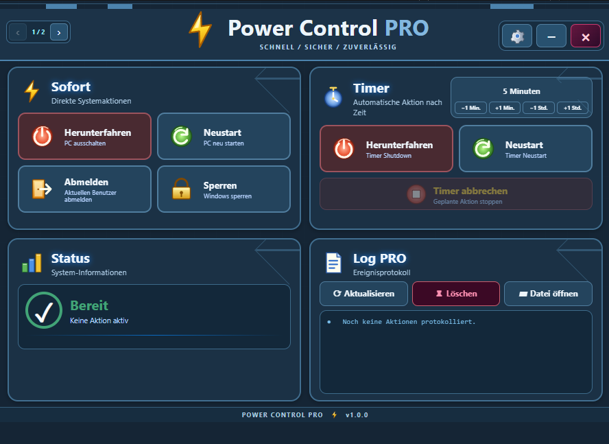

# Power Control PRO



Eine portable Windows-App für häufige Systemaktionen: Herunterfahren, Neustart,
Abmelden und Sperren. Zusätzlich bietet sie einen einstellbaren Timer,
Systemstatus, Aktionsprotokoll, Benutzerübersicht sowie auswählbare Designs
und Sprachen.

## Funktionen

- Sofortaktionen: Herunterfahren, Neustart, Abmelden und Windows sperren
- Timer für Herunterfahren oder Neustart, inklusive Abbruchfunktion
- Status- und Ereignisprotokoll
- Übersicht lokaler Windows-Benutzer
- Deutsche und englische Oberfläche
- Mehrere Designs, darunter Standard, Neon, Classic, Dark, Retro und Linux Mint
- Frameless Fenster mit eigenen Minimieren-, Schließen- und Einstellungs-Schaltflächen

## Starten ohne Installation

Die Datei `Power-Control-PRO.exe` ist eine portable Einzeldatei. Sie enthält
die benötigte Laufzeit und kann unter Windows per Doppelklick gestartet werden.
Beim ersten Start kann Windows SmartScreen nachfragen, weil die Datei nicht
digital signiert ist.

## Für Entwickler

```powershell
npm install
npm start
```

Prüfen des JavaScript-Quellcodes:

```powershell
node --check main.js
node --check preload.js
node --check renderer.js
```

Portable Windows-Version erzeugen:

```powershell
npm run package:win
npm run package:single-exe
```

Die Einzeldatei wird anschließend unter `outputs/Power-Control-PRO.exe` erstellt.

## Projektstruktur

- `assets/` – App-Icon, Oberflächen-Icons und Sounds
- `css/` – Designvarianten
- `locales/` – deutsche und englische Texte
- `scripts/` – Prüf- und Verpackungsskripte
- `docs/preview.png` – echte Vorschau der App

## Hinweis

Systemaktionen wie Herunterfahren oder Neustart werden ausschließlich über
fest definierte Windows-Befehle ausgelöst. Ein aktiver Timer sperrt
widersprüchliche Sofortaktionen, bis er abgebrochen oder ausgeführt wurde.
