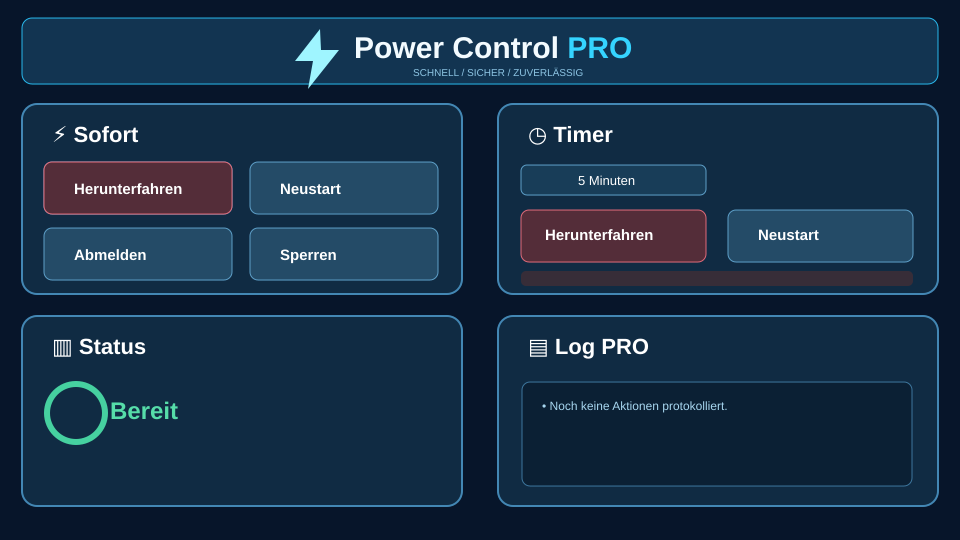

# Power Control PRO

Eine Windows-Desktop-App auf Electron-Basis für Schnellaktionen, zeitgesteuerte Energieaktionen, Systemstatus und Ereignisprotokolle.



## Funktionen

- Herunterfahren, Neustart, Abmelden und Windows sperren
- Timer für Herunterfahren oder Neustart, inklusive Abbruch
- System-Log und Autostart
- Benutzerübersicht mit aktuellem Konto
- Deutsch und Englisch
- Mehrere Designs: Standard, Neon, Classic, Dark, Retro, Linux Mint und Graphit
- Anpassbare Warn- und Klick-Sounds

## Starten

```powershell
npm install
npm start
```

## Verpacken für Windows

```powershell
npm run package:win
```

> Der Repository-Quellstand enthält bewusst keine native C++-Variante, keine Build-Ausgaben, keine EXE-Dateien und keine `node_modules`.
